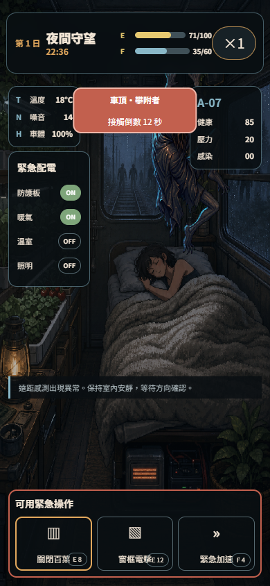

# 夜行列車：守夜協定

一款固定 9:16 的手機瀏覽器生存管理遊戲。玩家不是持槍角色，而是夜行列車的守護 AI：管理車廂電力、選擇路線、處理事件，並在乘客熟睡時阻止感染者突破車窗與車頂。



## 目前可玩內容

- 完整七夜旅程：整備 → 路線 → 行車事件 → 夜襲 → 黎明結算 → 結局。
- 8 個核心畫面與 A/B 狀態：主選單、局外中心、車廂、路線、事件、模組、科技、結算。
- 8 個資料驅動事件、3 條路線、12 個模組、5 個科技節點、2 種交替夜間威脅。
- IndexedDB current／backup 雙存檔，localStorage 降級，PWA 離線快取。
- 文字 100／120／140%、減少動態、無倒數、0.75× 守夜與音效開關。
- 原創車廂、A-07 與威脅圖層均由 runtime 實際載入，不使用攤平的 UI 截圖當遊戲畫面。
- 動態場景不是裝飾影片：Canvas 即時繪製車身搖晃、窗外雨霧與鐵軌流動、燈火、乘客呼吸；威脅依 Approach／Warning／Attack／Breach 分階段靠近與撞擊。
- 畫面進場依 03A／03B／05A／05B／08B 稿的資訊層級編排；只在真正換頁時播放，倒數重繪不會反覆觸發。

## 遊玩影片與畫面

- [直式遊玩影片（WebM，包含行車與威脅動態）](public/assets/video/night-train-gameplay.webm)
- [主選單](public/assets/screenshots/01-main-menu.png)
- [車廂整備](public/assets/screenshots/02-carriage-prep.png)
- [路線地圖](public/assets/screenshots/03-route-map.png)
- [EV004 廢棄水塔](public/assets/screenshots/04-event-water-tower.png)
- [T002 敲窗者接觸](public/assets/screenshots/08-night-knocker.png)
- [黎明結算](public/assets/screenshots/06-dawn-result.png)
- [七夜結局](public/assets/screenshots/07-ending.png)

## 本機執行

需要 Node.js 20 或更新版本。

```bash
npm ci
npm run dev
```

開啟 `http://localhost:4177`。完整驗證：

```bash
npm run check
```

重新錄製手機遊玩影片（需先啟動 dev server）：

```bash
npm run capture:video
```

## 技術結構

- TypeScript + Vite。
- DOM/CSS 負責可及性與精準 UI；Canvas 負責 720×1280 分層場景。
- `RunService` 是資源、事件、威脅、睡眠與 Ledger 的唯一權威寫入層。
- 固定 seed 的獨立 RNG stream 讓事件與威脅可重播。
- WebAudio 僅在首次互動後啟用；成品不含任何 OpenAI 或 xAI 金鑰。

詳細規格見 [瀏覽器改編規格](spec/spec-design-mobile-browser-adaptation.md) 與 [實作計畫](plan/feature-night-train-vertical-slice-1.md)。資產來源與產圖提示見 [ASSET_MANIFEST](docs/ASSET_MANIFEST.md)。

## 開源授權

- 程式碼與文件：GNU AGPL-3.0-or-later。
- `public/assets/art/` 原創圖像：CC BY 4.0，署名「夜行列車：守夜協定 contributors」。
- 原始 GDD、ZIP 與 16 張參考視覺稿不包含在公開儲存庫中。

參與開發前請閱讀 [CONTRIBUTING.md](CONTRIBUTING.md) 與 [THIRD_PARTY_NOTICES.md](THIRD_PARTY_NOTICES.md)。
