# 夜行列車：守夜協定

一款固定 9:16 的手機瀏覽器生存管理遊戲。玩家不是持槍角色，而是夜行列車的守護 AI：管理車廂電力、選擇路線、處理事件，並在乘客熟睡時阻止感染者突破車窗與車頂。

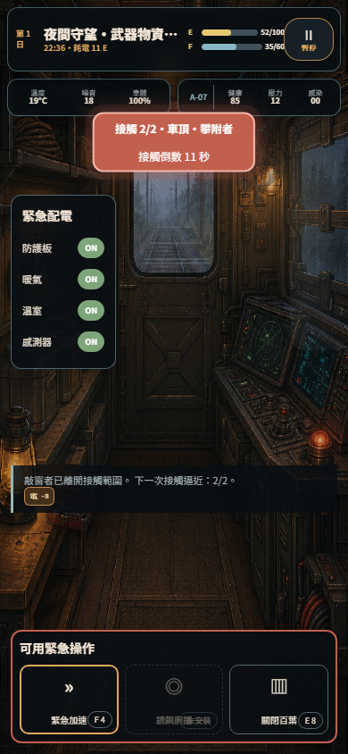

## 目前可玩內容

- 完整七夜旅程：整備 → 路線 → 行車事件 → 夜襲 → 黎明結算 → 結局。
- 整備階段有 3–5 AP：播種、收成、安撫、維修、工坊回收、烹飪與建造會實際消耗對應資源／行動點；睡眠品質決定隔日 AP。
- 五節可切換且畫面、配置、操作都不同的車廂：只有臥室保留床鋪；武器物資是裝甲監控站、工坊情報是雙側維修台、溫室是水耕農場、廚房儲藏是固定式列車餐廚。四張專用 GPT v2 底圖不是在同一張臥室上換小道具。
- 整備畫面採「先看車廂、再叫工具」：預設不再用大選單壓住場景，配電／配餐／佈置都是可收合抽屜；五節車廂功能改成場景內有文字、成本與狀態的操作牌。
- 手機可直接左右滑動切換車廂；第一次進入會顯示滑動提示，使用後自動收起。切換有方向過場與支援裝置的短震動，原本像失效按鈕的整備暫停位改為可讀 AP 儀表。
- 每次播種、烹飪、維修、安撫、回收等操作都會在底部即時顯示最多三項資源增減票籤，例如 `AP -1`、`水 -1`，不用從數字欄自行猜測結果。
- 溫室有兩個可見水培槽與 GPT 製作的葉萵苣、矮株番茄、香草四階段圖；播種 → 每日灌溉 → 連續兩個供電夜成長 → 成熟收成是正式玩法，不是裝飾圖。
- 配電會在入夜時實際扣除電量並依 P3 → P1 自動斷載；停用設備會同步改變可用反制。
- 安心／標準／節約三種配餐會在黎明影響食水、睡眠、壓力與信任；物資不足會造成健康損失。
- 夜間暫停鍵直接顯示「暫停／繼續」，而不是難辨識的倍速符號；路線威脅等級會真的形成 1／2／3 波連續接觸，每波顯示目前進度，只有最後一波解除後才進入黎明。威脅逐夜加速、破口傷害逐夜提高，健康或車體歸零會進入可重玩的失敗結局。
- 車廂佈置模式提供 4 件 GPT 製作的透明小物：黃銅燈、短波機、工具箱與蕨盆栽；五節車廂共 15 個具語意的掛鉤、牆面、檯面、窗台、層架與地面槽位，綠色可放、紅色不相容、占用中不可覆蓋，支援點放、滑鼠／手指拖曳吸附、重設、存檔與重載復原。
- 8 個核心畫面與 A/B 狀態：主選單、局外中心、車廂、路線、事件、模組、科技、結算。
- 8 個資料驅動事件、3 條路線、12 個模組、5 個科技節點、2 種交替夜間威脅。
- IndexedDB current／backup 雙存檔，localStorage 降級，PWA 離線快取。
- 文字 100／120／140%、減少動態、無倒數、0.75× 守夜與音效開關。
- 原創車廂、A-07 與威脅圖層均由 runtime 實際載入，不使用攤平的 UI 截圖當遊戲畫面。
- 動態場景不是裝飾影片：Canvas 即時繪製車身搖晃、窗外雨霧與鐵軌流動、燈火、乘客呼吸；威脅依 Approach／Warning／Attack／Breach 分階段靠近與撞擊。
- 畫面進場依 03A／03B／05A／05B／08B 稿的資訊層級編排；只在真正換頁時播放，倒數重繪不會反覆觸發。

## 遊玩影片與畫面

- [直式遊玩影片（WebM，包含行車與威脅動態）](public/assets/video/night-train-gameplay.webm)
- [主選單](public/assets/screenshots/01-main-menu.png)
- [車廂整備](public/assets/screenshots/02-carriage-prep.png)
- [路線地圖](public/assets/screenshots/03-route-map.png)
- [EV004 廢棄水塔](public/assets/screenshots/04-event-water-tower.png)
- [T002 敲窗者接觸](public/assets/screenshots/08-night-knocker.png)
- [黎明結算](public/assets/screenshots/06-dawn-result.png)
- [七夜結局](public/assets/screenshots/07-ending.png)

以下三張是 v0.3.1 全按鈕實機稽核直接截取的 390×844 遊戲畫面，已隨開源專案提交，不是另外製作的概念稿：

| 破口後維修 | 局外路線預覽 | 起始藍圖預覽 |
|---|---|---|
| 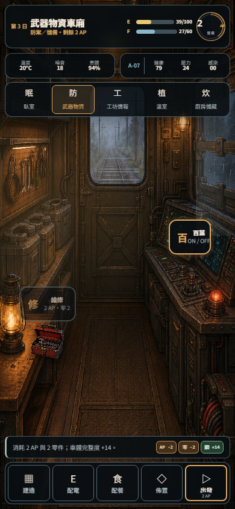 | 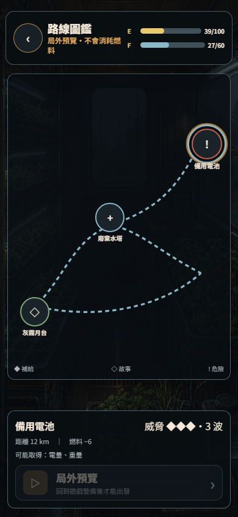 | 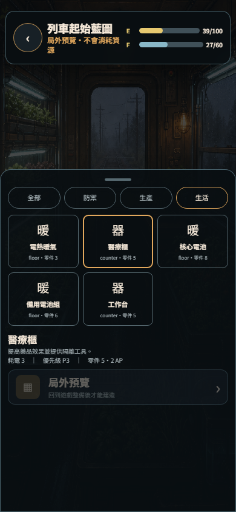 |

| 小物拖曳配置 | 完成後正常遊玩 |
|---|---|
| 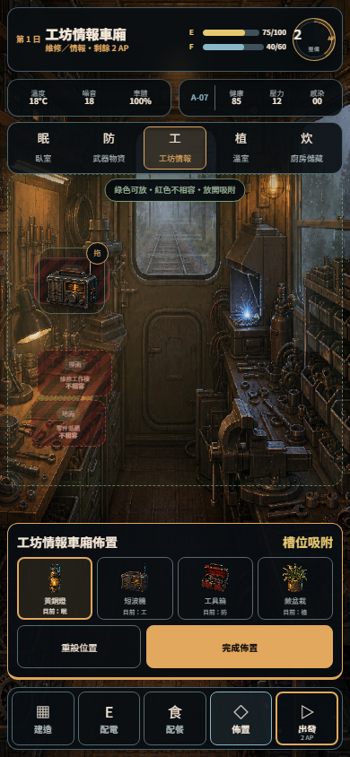 | 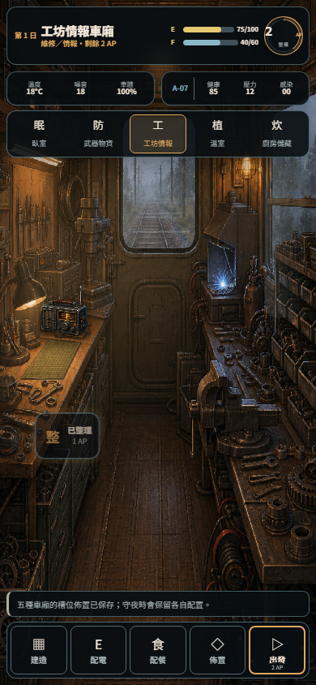 |

以下為 v0.8.0 從同一個可玩版本直接截取的五車廂與農業／槽位畫面；不是獨立概念圖：

| 臥室車廂 | 武器物資車廂 | 工坊情報車廂 |
|---|---|---|
| 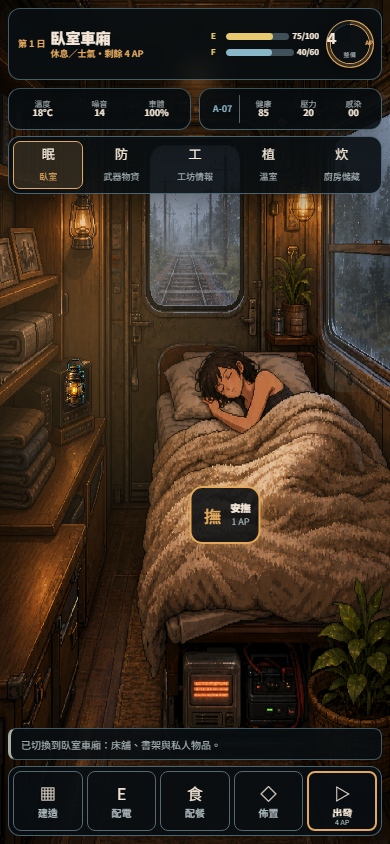 | 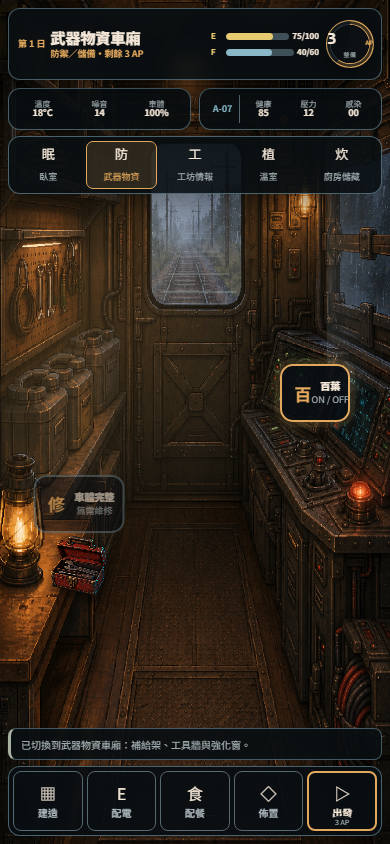 | 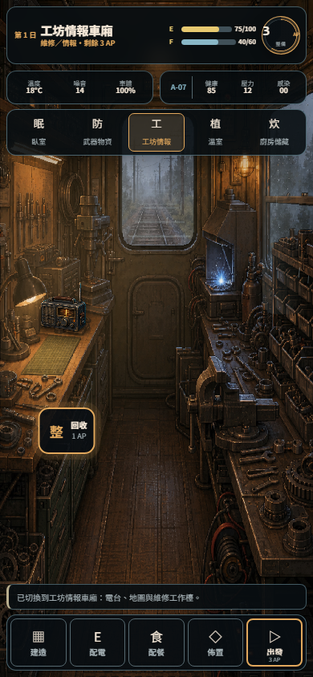 |

| 溫室成熟番茄 | 廚房儲藏車廂 | 相容槽位配置 |
|---|---|---|
| 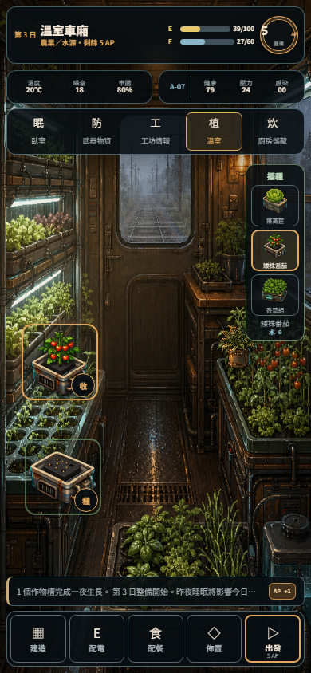 | 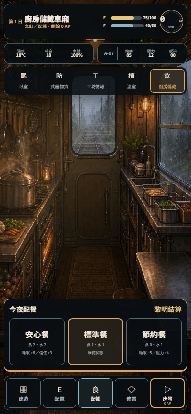 | 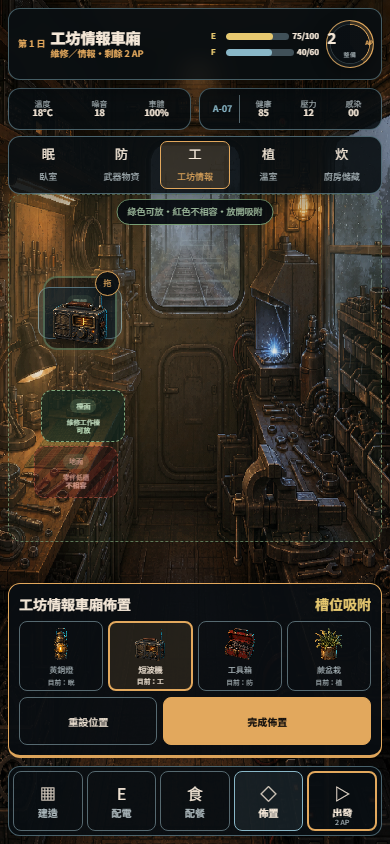 |

| 360×640 小螢幕觀察模式 | 主動畫面保留的可收合配電工具 |
|---|---|
| 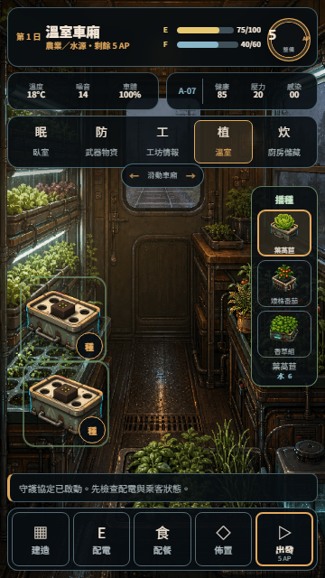 | 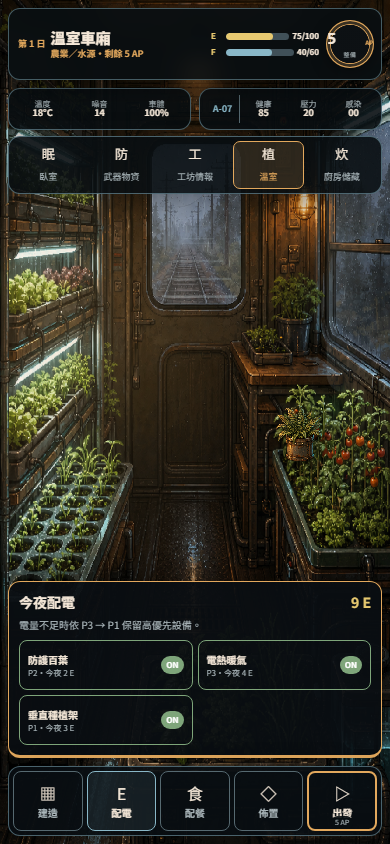 |

| 第一次滑動導引與 AP 儀表 | 播種後可見的資源增減 |
|---|---|
| 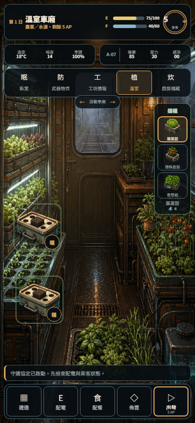 | 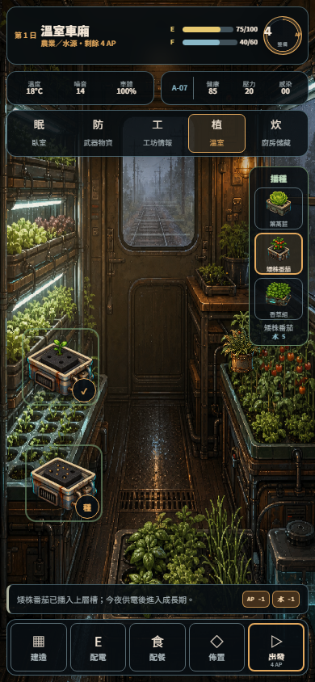 |

| 中風險路線第 2／2 波 |
|---|
|  |

v0.8.0 的真人視角驗收不是只檢查函式：Playwright 真的在 390×844 與 360×640 瀏覽器中以可見中心座標點擊與滑動，並檢查中心沒有被透明層或面板攔截。預設 390×844 車廂保有 534px 不被面板切斷的畫面，360×640 保有 338px；最小可點區為 60×48px、底部指令列 70px，49 種操作共通過 498 項瀏覽器斷言。詳見 [手機肉眼可玩性驗收](docs/MOBILE_VISUAL_QA.md) 與 [可公開下載的 JSON 報告](public/assets/qa/mobile-playability-report.json)。

## 本機執行

需要 Node.js 20 或更新版本。

```bash
npm ci
npm run dev
```

開啟 `http://localhost:4177`。完整驗證：

```bash
npm run check
```

重新錄製手機遊玩影片（需先啟動 dev server）：

```bash
npm run capture:video
```

手機可玩性驗收（配電、配餐、播種、夜間成長、暫停與黎明結算）：

```bash
npm run capture:playability
```

全操作手機瀏覽器稽核（49 種操作、390×844／360×640 肉眼版面、可見中心實際點擊、左右滑動、可收合工具、五車廂、1／2／3 波路線風險、兩夜種植／澆水／收成、相容槽點放與實際拖曳、重載保存、局外預覽與破口維修）：

```bash
npm run audit:buttons
```

## 技術結構

- TypeScript + Vite。
- DOM/CSS 負責可及性與精準 UI；Canvas 負責 720×1280 分層場景。
- `RunService` 是資源、事件、威脅、睡眠與 Ledger 的唯一權威寫入層。
- 固定 seed 的獨立 RNG stream 讓事件與威脅可重播。
- WebAudio 僅在首次互動後啟用；成品不含任何 OpenAI 或 xAI 金鑰。

詳細規格見 [瀏覽器改編規格](spec/spec-design-mobile-browser-adaptation.md) 與 [實作計畫](plan/feature-night-train-vertical-slice-1.md)。資產來源與產圖提示見 [ASSET_MANIFEST](docs/ASSET_MANIFEST.md)。

## 開源授權

- 程式碼與文件：GNU AGPL-3.0-or-later。
- `public/assets/art/` 原創圖像：CC BY 4.0，署名「夜行列車：守夜協定 contributors」。
- 原始 GDD、ZIP 與 16 張參考視覺稿不包含在公開儲存庫中。

參與開發前請閱讀 [CONTRIBUTING.md](CONTRIBUTING.md) 與 [THIRD_PARTY_NOTICES.md](THIRD_PARTY_NOTICES.md)。
