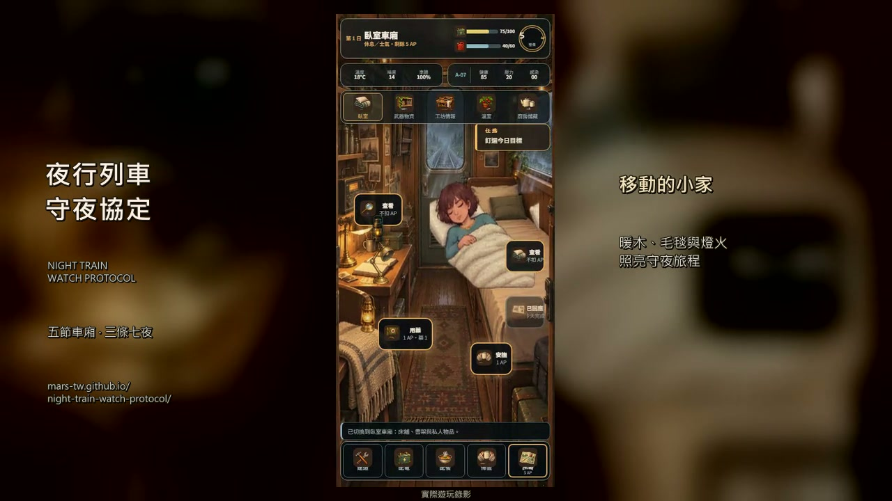
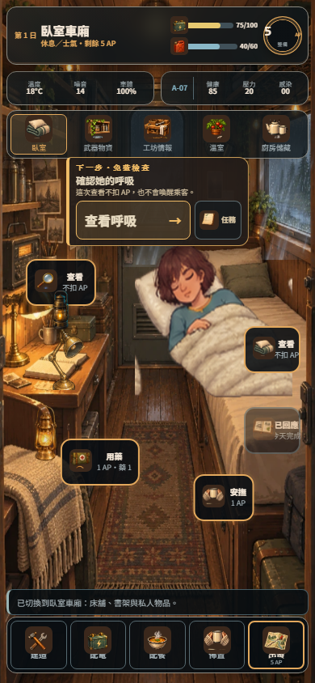

# 夜行列車：守夜協定 v2.2.0

[](https://mars-tw.github.io/night-train-watch-protocol/trailer.html)

[觀看遊戲宣傳片](https://mars-tw.github.io/night-train-watch-protocol/trailer.html) · [直接遊玩](https://mars-tw.github.io/night-train-watch-protocol/)

你是列車的守護系統。白天照顧乘客 A-07、修理設備、種植與停站探索；夜裡觀察窗外的線索，選擇反制與資源取捨，讓這個移動的小家繼續前進。

[完整企劃](docs/reboot-v2/GAME_DESIGN.md) · [圖片動畫與來源](docs/reboot-v21/ASSET_RUNTIME_V21.md)

固定 9:16，手機瀏覽器與桌機皆可操作，支援離線保存。每一條故事線是一段完整七夜旅程，可逐夜保存、失敗重試。



## 這次更新

- **首夜下一步**：R01 前兩日依實際任務進度，提示免費觀察、配電、配餐、播種、選路與夜間反制。播種仍先預覽成本；夜間按鈕標明反制名稱與成本。任務入口保留，釘選自己的目標後，指引就會讓位。
- **看得見的離線準備**：主選單顯示下載中、完成、失敗重試與更新狀態。完整快取成功才顯示可離線；下載失敗保留上一版與存檔，遊玩中不強制重載。
- **原畫質分段載入**：A-07 的 52 格真姿勢改為七段無損 WebP，依目前動作載入。首畫面必要場景與角色圖片由 1,730,562 降至 430,790 bytes，減少 75.11%；這是首畫面圖片重量，完整離線快取仍約 13.57 MiB。原始圖集保留；有損壓縮未通過細節門檻，沒有用於正式角色。
- **宣傳頁更好操作**：手機首次開啟預設直式影片，可切換橫式並保留播放位置與暫停狀態，也能直接跳到料理、任務、守夜及探索章節。首頁仍使用實際遊玩錄製的宣傳片。

## 遊戲內容

- **五廂畫質重製**：從原始手繪圖片重新輸出，移除粗重顆粒與量化；暖木作、毛毯、金屬、食物與冷窗保留細節，夜景也降低黑色遮罩。A-07 只在唯一主床。
- **圖片介面與物件**：32 格手繪儀表圖示、16 個道具、紙本路線／科技圖和 PNG app icon。主要場景熱區、工具、車廂列與地圖使用圖片，實際瀏覽器驗證沒有 SVG 元素或請求。
- **環境逐幀動畫**：蒸氣、燈火、葉片各四個不同畫格；雨霧與霜限於車窗，減少動態及暫停設定仍有效。新九張圖片由 Blender 5.2 實際處理，合計 1.679 MiB。
- **真正姿勢圖集**：A-07 52 格、五個威脅家族各 20 格、設備 50 格。12 張生成來源由 Blender 5.2 實際處理，圖層與狀態由 runtime 使用；照片與廣告介面不進遊戲。
- **56 項任務**：21 主線、5 教學、10 關係、8 設施、6 探索、6 挑戰。支援兩項釘選、期限、保底前情、互斥改裝與單次領獎；觀看、取消、快速連點與重載不刷獎勵。
- **照顧與生產**：整備有 3–5 AP。播種、收成、回收、熱食、安撫、修理與用藥有實際成本；萵苣 1 夜、番茄 3 夜、香草 2 夜，皆需供電與灌溉。
- **探索與改裝**：每日最多一次三節點探索，可撤回並保留已找到的物資。8 項設施形成 4 組互斥用途，升級會改變實際功能與場景。
- **可靠跨局成長**：Profile 保存路線、日誌、9 種起始藍圖及 8 種外觀。玩家可選一種有代價的下局配置與外觀；新局重設生存資源，選配不疊加永久數值。
- **機能實效**：電池容量、再生煞車、窗框減傷、雨水收集、維修效率、陷阱、醫療與備援皆有運算落點。建造使用有容量與相容性的機能槽。
- **守夜與補救**：觀察、判斷、工具與處置。攀附者可用燃料加速或消耗一個零件切離扣具；缺少作者證據仍可明示保留疑問，繼續主線。
- **手機操作**：先看車廂、再叫工具；成本預覽可取消，面板可關，拖曳有點選替代。文字 100／120／140%、減少動態、無倒數、慢速與靜音皆保留。
- **存檔與更新**：schema 1–5 匯入 schema 6，舊 key 與備份保留。run、Profile、任務及領獎憑據一起保存，損壞時恢復備份；PWA 以 build manifest 安裝整份資產，避免半套更新。
- **圖片載入**：按目前車廂與角色動作載入，完整遊戲素材另由 PWA 準備離線快取。五廂與介面沿用 v2.1 圖片；角色、威脅和設備使用無損 WebP。原始 PNG、處理檔與製作紀錄仍保留供開源使用。

## 三條七夜故事

| 故事線 | 核心取捨 | 第四夜永久分支 |
| --- | --- | --- |
| R01 灰霧線 | 訊號來源、身分、同意與封鎖 | GO／DETOUR／STOP |
| R02 白霜線 | 保暖、除冰、燃料與照護 | CARE／CLEAR／SUSTAIN |
| R03 綠潮線 | 水循環、污染、種庫與共生 | CULTIVATE／FILTER／PURGE |

正式路線解鎖使用 Profile：完成第三夜後結束旅程或完成七夜會開放 R02；完成五教學並完成一條七夜會開放 R03。尚未正式開放時，主選單另提供清楚標示的可玩預覽。

## 操作

1. 左右滑動或按車廂列切換；點設備看狀態和可做的事。
2. 分配電力與配餐，操作前看 AP／物資成本，確認後才扣款。
3. 看路段的消耗、補給與威脅，決定是否探索。
4. 守夜時先讀線索，再選工具；暫停與無倒數模式可慢慢判斷。
5. 黎明看後果、領任務成果，再開始下一夜。

離開頁面會保存，守夜不會在背景繼續扣狀態。離線可用性需先完成首次安裝的資產快取。

## 本機執行

需要 Node.js 20.19+ 或 22.12+。

```sh
npm ci
npx playwright install chromium
npm run dev
```

開啟 `http://localhost:4177`。正式建置與驗證：

```sh
npm run check
npm run preview -- --port 4312
npm run audit:v2
npm run audit:journeys
npm run audit:release
npm run audit:raster
npm run audit:trailer
npm run audit:loading
npm run audit:onboarding
npm run simulate:balance
```

`check` 包含 TypeScript、Vitest、正式建置與離線 manifest。瀏覽器驗收預設連 `4177`（UI／旅程）或 `4312`（正式版／離線），可用 `GAME_URL` 指定。

## 驗證證據

- [v2.2 首夜指引：五項教學實際完成與保存](docs/evidence/v22/onboarding-qa.json)
- [v2.2 手機操作與 15 組視口／字級矩陣](docs/evidence/v22/ui-qa.json)
- [v2.2 無損分段、首畫面請求與離線檔案量](docs/evidence/v22/loading-qa.json)
- [v2.2 角色逐格無損驗證與被拒絕的有損實驗](docs/reboot-v22/ATLAS_RUNTIME_V22.md)
- [v2.2 圖片、真畫格與零 SVG 驗收](docs/evidence/v22/raster-qa.json)
- [v2.2 宣傳頁橫直式切換與播放狀態](docs/evidence/v22/trailer-experience-qa.json)
- [v2.2 已安裝 PWA 的影片與斷網返回](docs/evidence/v22/installed-navigation-qa.json)
- [v2.2 正式版離線與效能](docs/evidence/v22/release-qa.json)
- [v2.2 更新驗收](docs/CODEX_RESPONSE_V22.md)
- [v2.1 圖片、真畫格與零 SVG 驗收](docs/evidence/v21/raster-qa.json)
- [v2.1 手機操作與 15 組視口／字級矩陣](docs/evidence/v21/ui-qa.json)
- [v2.1 正式版離線與效能](docs/evidence/v21/release-qa.json)
- [v2.1 素材來源、Blender 與 SHA](public/assets/art/v21/pipeline-report.json)
- [v2.1 更新驗收](docs/CODEX_RESPONSE_V21.md)
- [手機操作與 15 組視口／字級矩陣](docs/evidence/v2/ui-qa.json)
- [完整七夜 UI 流程](docs/evidence/v2/journey-qa.json)
- [正式版、離線與效能](docs/evidence/v2/release-qa.json)
- [270 局固定策略平衡模擬](docs/evidence/v2/balance-report.md)
- [生成來源、SHA、圖集、透明邊緣與色彩](public/assets/art/v2/pipeline-report.json)
- [更新總驗收](docs/CODEX_RESPONSE_V2.md)

上述自動化與實際按鍵驗證各自標示資料來源。手機尺寸的 Chromium 量測使用桌機宿主；不把它寫成實體 iOS／Android 裝置測試，也不把固定策略模擬當盲測玩家研究。

## 技術結構

TypeScript＋Vite，DOM／CSS 負責可及性與控制，Canvas 負責 720×1280 場景。`RunService` 是資源、行動與故事的權威；任務消費成功提交的事件，`voyage` 提供可測的探索／關係／改裝交易；Profile 與本局資料分離。所有選擇與探索使用固定 seed，重載不能重新抽補給。

圖片生成工具與後處理紀錄均可追溯。工具未提供可驗證的模型 identifier，metadata 保持 `null`，不冒稱已確認某個模型。成品不含生成服務金鑰。

## 開源授權

- 程式碼與文件：GNU AGPL-3.0-or-later。
- `public/assets/art/` 圖像：CC BY 4.0，署名「夜行列車：守夜協定 contributors」。
- 宣傳影片、封面與實錄來源：CC BY 4.0，署名同上；原創宣傳配樂採 CC0-1.0，詳見 [影片授權](public/assets/video/night-train-promo-v211.LICENSE.txt)。
- 新圖來源與處理：[ASSET_PROMPTS_V2.json](docs/reboot-v2/ASSET_PROMPTS_V2.json)、[ASSET_RUNTIME_V2.md](docs/reboot-v2/ASSET_RUNTIME_V2.md)。
- v2.1 圖片提示與處理：[IMAGE_PROMPTS.json](docs/reboot-v21/IMAGE_PROMPTS.json)、[ASSET_RUNTIME_V21.md](docs/reboot-v21/ASSET_RUNTIME_V21.md)。
- 使用者廣告照片、原始私人 GDD／ZIP 不包含在公開專案。

參與開發請閱讀 [CONTRIBUTING.md](CONTRIBUTING.md)、[THIRD_PARTY_NOTICES.md](THIRD_PARTY_NOTICES.md)。

## 歷史版本證據

以下是 v0.8–v1.1 的既有實機資料，保留供內容回歸與分支比較；v2 的新畫面與驗收請看上方 v2 證據。部分舊錄影使用已明示的故事 checkpoint，不作 v2 自然七夜證據。

[綠潮線舊版驗收](public/assets/qa/green-story-flow-report.json) · [白霜線舊版驗收](public/assets/qa/frost-story-flow-report.json) · [舊版手機操作](public/assets/qa/mobile-playability-report.json)

- [01-main-menu.png](public/assets/screenshots/01-main-menu.png)
- [02-carriage-prep.png](public/assets/screenshots/02-carriage-prep.png)
- [03-route-map.png](public/assets/screenshots/03-route-map.png)
- [04-event-water-tower.png](public/assets/screenshots/04-event-water-tower.png)
- [05-night-contact.png](public/assets/screenshots/05-night-contact.png)
- [06-dawn-result.png](public/assets/screenshots/06-dawn-result.png)
- [07-ending.png](public/assets/screenshots/07-ending.png)
- [08-night-knocker.png](public/assets/screenshots/08-night-knocker.png)
- [09-repaired-carriage.png](public/assets/screenshots/09-repaired-carriage.png)
- [10-route-preview.png](public/assets/screenshots/10-route-preview.png)
- [11-module-preview.png](public/assets/screenshots/11-module-preview.png)
- [12-decor-placement.png](public/assets/screenshots/12-decor-placement.png)
- [13-decor-in-play.png](public/assets/screenshots/13-decor-in-play.png)
- [14-sleep-carriage.png](public/assets/screenshots/14-sleep-carriage.png)
- [15-defense-carriage.png](public/assets/screenshots/15-defense-carriage.png)
- [16-workshop-carriage.png](public/assets/screenshots/16-workshop-carriage.png)
- [17-greenhouse-farming.png](public/assets/screenshots/17-greenhouse-farming.png)
- [18-kitchen-carriage.png](public/assets/screenshots/18-kitchen-carriage.png)
- [19-slot-placement.png](public/assets/screenshots/19-slot-placement.png)
- [20-compact-observation.png](public/assets/screenshots/20-compact-observation.png)
- [21-collapsible-power.png](public/assets/screenshots/21-collapsible-power.png)
- [22-swipe-guidance.png](public/assets/screenshots/22-swipe-guidance.png)
- [23-action-feedback.png](public/assets/screenshots/23-action-feedback.png)
- [24-route-risk-waves.png](public/assets/screenshots/24-route-risk-waves.png)
- [25-story-day4-branches.png](public/assets/screenshots/25-story-day4-branches.png)
- [26-story-day7-decisions.png](public/assets/screenshots/26-story-day7-decisions.png)
- [27-story-ending.png](public/assets/screenshots/27-story-ending.png)
- [28-story-t004-fog-vine.png](public/assets/screenshots/28-story-t004-fog-vine.png)
- [29-story-t005-echo-passenger.png](public/assets/screenshots/29-story-t005-echo-passenger.png)
- [30-story-t006-silent-crowd.png](public/assets/screenshots/30-story-t006-silent-crowd.png)
- [frost-care-carriage-v100.png](public/assets/screenshots/frost-care-carriage-v100.png)
- [frost-care-ending-decisions-v100.png](public/assets/screenshots/frost-care-ending-decisions-v100.png)
- [frost-care-ending-v100.png](public/assets/screenshots/frost-care-ending-v100.png)
- [frost-care-t009-first-miss-v100.png](public/assets/screenshots/frost-care-t009-first-miss-v100.png)
- [frost-care-thermal-day7-v100.png](public/assets/screenshots/frost-care-thermal-day7-v100.png)
- [frost-clear-carriage-v100.png](public/assets/screenshots/frost-clear-carriage-v100.png)
- [frost-clear-ending-decisions-v100.png](public/assets/screenshots/frost-clear-ending-decisions-v100.png)
- [frost-clear-ending-v100.png](public/assets/screenshots/frost-clear-ending-v100.png)
- [frost-clear-t009-first-miss-v100.png](public/assets/screenshots/frost-clear-t009-first-miss-v100.png)
- [frost-clear-thermal-day7-v100.png](public/assets/screenshots/frost-clear-thermal-day7-v100.png)
- [frost-emergency-route-360x640-v100.png](public/assets/screenshots/frost-emergency-route-360x640-v100.png)
- [frost-emergency-shelter-ending-v100.png](public/assets/screenshots/frost-emergency-shelter-ending-v100.png)
- [frost-ev057-three-branches-v100.png](public/assets/screenshots/frost-ev057-three-branches-v100.png)
- [frost-route-selection-v100.png](public/assets/screenshots/frost-route-selection-v100.png)
- [frost-sustain-carriage-v100.png](public/assets/screenshots/frost-sustain-carriage-v100.png)
- [frost-sustain-ending-decisions-v100.png](public/assets/screenshots/frost-sustain-ending-decisions-v100.png)
- [frost-sustain-ending-v100.png](public/assets/screenshots/frost-sustain-ending-v100.png)
- [frost-sustain-t009-first-miss-v100.png](public/assets/screenshots/frost-sustain-t009-first-miss-v100.png)
- [frost-sustain-thermal-day7-v100.png](public/assets/screenshots/frost-sustain-thermal-day7-v100.png)
- [frost-t009-first-miss-360x640-text140-v100.png](public/assets/screenshots/frost-t009-first-miss-360x640-text140-v100.png)
- [frost-thermal-drawer-360x640-text140-v100.png](public/assets/screenshots/frost-thermal-drawer-360x640-text140-v100.png)
- [frost-thermal-pointer-drag-v100.png](public/assets/screenshots/frost-thermal-pointer-drag-v100.png)
- [green-cultivate-carriage-v110.png](public/assets/screenshots/green-cultivate-carriage-v110.png)
- [green-cultivate-ending-v110.png](public/assets/screenshots/green-cultivate-ending-v110.png)
- [green-cultivate-t008-first-miss-v110.png](public/assets/screenshots/green-cultivate-t008-first-miss-v110.png)
- [green-cultivate-t013-cycle-v110.png](public/assets/screenshots/green-cultivate-t013-cycle-v110.png)
- [green-cycle-board-360x640-text140-v110.png](public/assets/screenshots/green-cycle-board-360x640-text140-v110.png)
- [green-ev066-intake-v110.png](public/assets/screenshots/green-ev066-intake-v110.png)
- [green-ev072-three-branches-v110.png](public/assets/screenshots/green-ev072-three-branches-v110.png)
- [green-ev078-four-endings-v110.png](public/assets/screenshots/green-ev078-four-endings-v110.png)
- [green-filter-carriage-v110.png](public/assets/screenshots/green-filter-carriage-v110.png)
- [green-filter-ending-v110.png](public/assets/screenshots/green-filter-ending-v110.png)
- [green-filter-t008-first-miss-v110.png](public/assets/screenshots/green-filter-t008-first-miss-v110.png)
- [green-filter-t013-cycle-v110.png](public/assets/screenshots/green-filter-t013-cycle-v110.png)
- [green-purge-carriage-v110.png](public/assets/screenshots/green-purge-carriage-v110.png)
- [green-purge-ending-v110.png](public/assets/screenshots/green-purge-ending-v110.png)
- [green-purge-t008-first-miss-v110.png](public/assets/screenshots/green-purge-t008-first-miss-v110.png)
- [green-purge-t013-cycle-v110.png](public/assets/screenshots/green-purge-t013-cycle-v110.png)
- [green-quarantine-ending-v110.png](public/assets/screenshots/green-quarantine-ending-v110.png)
- [green-route-selection-v110.png](public/assets/screenshots/green-route-selection-v110.png)
- [night-train-frost-v100-care.webm](public/assets/video/night-train-frost-v100-care.webm)
- [night-train-frost-v100-clear.webm](public/assets/video/night-train-frost-v100-clear.webm)
- [night-train-frost-v100-sustain.webm](public/assets/video/night-train-frost-v100-sustain.webm)
- [night-train-gameplay.webm](public/assets/video/night-train-gameplay.webm)
- [night-train-green-v110-cultivate.webm](public/assets/video/night-train-green-v110-cultivate.webm)
- [night-train-green-v110-filter.webm](public/assets/video/night-train-green-v110-filter.webm)
- [night-train-green-v110-purge.webm](public/assets/video/night-train-green-v110-purge.webm)
- [night-train-story-v090-detour.webm](public/assets/video/night-train-story-v090-detour.webm)
- [night-train-story-v090-stop.webm](public/assets/video/night-train-story-v090-stop.webm)
- [night-train-story-v090.webm](public/assets/video/night-train-story-v090.webm)
